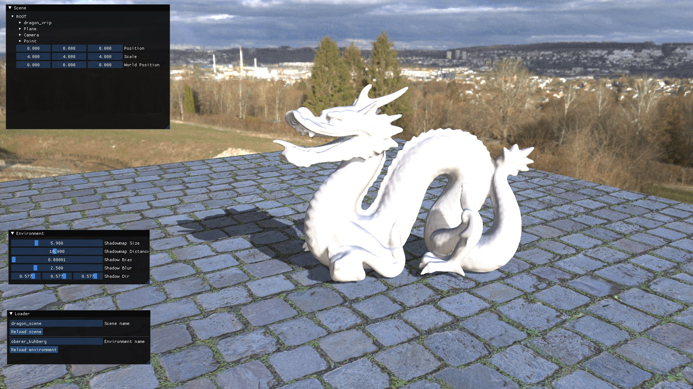
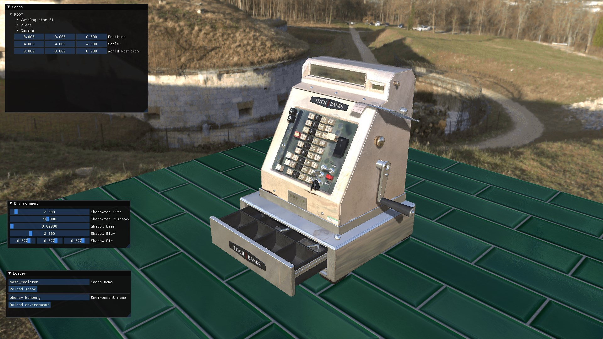

# Graphics Project
I created this project for my independent study in computer graphics at Bob Jones University.
I followed [Computer Graphics Programming in OpenGL with C++ (2nd Edition)](http://www.merclearning.com/titles/Computer-Graphics-Programming-in-OpenGL-with-C++-2E.html) for the basics of the project.
It uses OpenGL for rendering, GLFW for window management, and ImGUI for the GUI.
Scenes are loaded from GLTF files.

## Screenshots





## Building
### Windows
```
git clone --recursive https://github.com/EliasWatson/Graphics-Project.git
cmake -S Graphics-Project -B Graphics-Project/build
cmake --build Graphics-Project/build
```
Then double-click the executable in Graphics-Project/build/Debug

### Linux
```
git clone --recursive https://github.com/EliasWatson/Graphics-Project.git
cd Graphics-Project
cmake .
make
./Graphics-Project
```